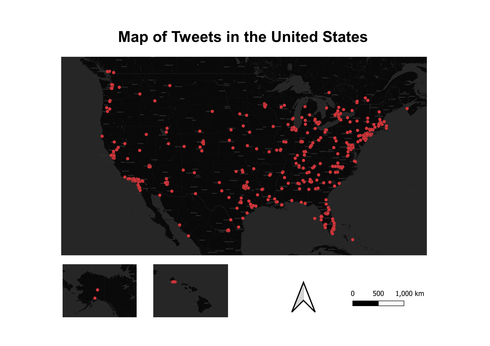

# Geo-tagged Tweet

#### The map is Twitter data that is geo-tagged in the US and filtered through a keyword "president". The map demonstrates the distribution of twitter users who have posted tweets  related to the timely topic about "president". January 20 is the inauguration for the new president. From the map, it shows that people in the east coast posted lots of tweets related to the topic about "President", which imply that most twitter users in the east coast are interested in the news about "President". 
